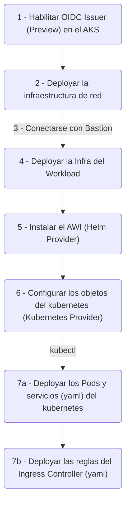

# BASA ODI - Prueba de Concepto, Cluster AKS Multi-Region

Una PoC para armar un cluster manejado de Azure Kubernetes deployado en multi region para darle soporte al Disaster Recovery y la Alta Disponibilidad. Utilice Terraform para IaaC de la infra.

Utilice la base documental sobre AKS en Multiregion de la pagina oficil de Microsoft [AKS Baseline for Multiregion AKS Clusters](https://docs.microsoft.com/en-us/azure/architecture/reference-architectures/containers/aks-multi-region/aks-multi-cluster).

## Arquitectura de la Solucion

![Multi-region Solution][1]

### Workload Identity

Esta solucion tambien implementa Azure Workload Identity.

Permitir que los Pods se conecten directamente a los Key Vaults sin intercambiar el token de KV acabó siendo un proyecto aparte.
[azure-workload-identity-terraform](https://github.com/epomatti/azure-workload-identity-terraform).

![Worload Identity][2]

## Deployando en la Nube

Estos son los pasos a alto nivel para deployar la solucion



### 1 - Habilitar OIDC Issuer (Preview)

Hay que habilitar [OIDC Preview](https://docs.microsoft.com/en-us/azure/aks/cluster-configuration#oidc-issuer-preview) com parte del manejo de la configuracion de la seguridad integrada. Seguir los pasos en ese link.

### 2 - Deployar la Infra de Red

Estos son los componentes base sobre los que se desplegará los workloads:

```sh
# Crear los recursos de Azure
terraform -chdir='infrastructure/network' init
terraform -chdir='infrastructure/network' apply -auto-approve
```

Todo es privado, nada esta expuesto con IP Publicas. Para acceder se puede usar la VM creado en cada region usando Bastion, o conectarse a la VPN.

### 3 - Conectarse al Bastion

La VM jumpbox se iniciará con un script `cloud-init` para instalar Terraform, Azure CLI y Kubectl automáticamente. Utilizar Bastion para conectarse a la máquina virtual y clonar/descargar el código fuente de nuevo.

Hay que volver a loguear a Azure con `az login`.

### 4 - Infra de Workload

Este script creara estos recursos: AKS, Cosmos, Ingress, Key Vault, Log Analytics, entre otros

```sh
terraform -chdir='infrastructure/azure' init
terraform -chdir='infrastructure/azure' apply -auto-approve
```

### 5 - Setup de Helm, mas Identidad de Workload 

Este script deploya los componentes de Identidad de Workload usando el proveedor de Helm

```sh
terraform -chdir='infrastructure/helm' init
terraform -chdir='infrastructure/helm' apply -auto-approve
```

Hay que ejecutar este script en ambos cluster (main y failover)

### 6 - Configuracion del Kubernetes

Configuracion de los recursos del Kubernetes, como el config map y secrets con las cadenas de conexion que son designadas dinamicamente por azure.

```sh
terraform -chdir='infrastructure/kubernetes' init
terraform -chdir='infrastructure/kubernetes' apply -auto-approve
```

Tambien hay que ejecutar este script en ambos cluster (main y failover)

Para conectarse al kubernetes se puede usar la variable de output que genera el terraform:

```terraform
aks_get_credentials_command = "az aks get-credentials -g <rg> -n <aks>"
```


### 7 - Deployar el Manifest del Kubernetes

Crea los objetos de Kubernetes definidos en los archivos de manifiesto yaml.

```sh
# Conectarse al cluster
group='<resource_group_name>'
aks='<ask_cluster_name>'

az aks get-credentials -g $group -n $aks

# Crear los Deploy y Services
kubectl apply -f 'kubernetes'

# Deploya las reglas al Application Gateway
kubectl apply -f 'kubernetes/azure'
```

Nuevamente hay que ejecutar este script en ambos cluster (main y failover)

Listo! Los servicios estan disponibles mediente el endpoint de Azure Front Door.

## Deploy Local

Iniciar MongoDB

```sh
docker run -d --name mongodb -p 27017:27017 mongo
```

Trabajar con los microservicios (abrir cada uno individualmente en VS Code para una mejor experiencia):

```sh
# Crea el venv dentro del proyecto
mkdir .venv

cp config/dev.env .env
cp config/dev.flaskenv .flaskenv

# Ad-hoc fix para https://github.com/pypa/setuptools/issues/3278
export SETUPTOOLS_USE_DISTUTILS=stdlib

# obtiene las dependencias
pipenv install --dev
pipenv shell

# inicializa
python3 -m flask run
```
###  Modulo principal

El codigo en comun es compartido en el modulo principal

Para codearlo:

```bash
poetry install
poetry shell
```

Para publicarlo, hacer un bump de la verion en `pyproject.toml` y luego:

```bash
poetry build
poetry publish
```

### Deploy local con recursos de la nube

Esto creará los recursos necesarios para desarrollar localmente pero con recursos Azure en lugar de locales, lo cual es útil para probar antes de impulsar las pruebas de integración.

```sh
terraform -chdir='infrastructure/development' init
terraform -chdir='infrastructure/development' apply -auto-approve
```

Setear el Key Vault URI al archivo  `.env` 

La autenticación funciona a través del contexto local, por lo que debe estar conectado con `az login`. Los SDK de Microsoft detectarán automáticamente el contexto autenticado al conectarse a Key Vault.

### Minikube

```sh
minikube start
minikube addons enable ingress

kubectl apply -f kubernetes/minikube/mongo.yaml
kubectl apply -f kubernetes/kubernetes.yaml
kubectl apply -f kubernetes/minikube/nginx-ingress.yaml

minikube tunnel
```

### Docker

```
docker build --tag poll .
docker build --tag vote .

docker run -p 4000:8080 --name poll-app poll
docker run -p 5000:8080 --name vote-app vote
```

O con Docker Compose:

```sh
docker-compose build
docker-compose up
```

[1]: .docs/multiregion-aks.png
[2]: .docs/workload-identity.png
